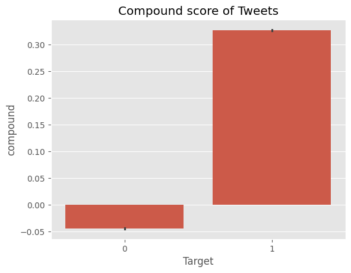
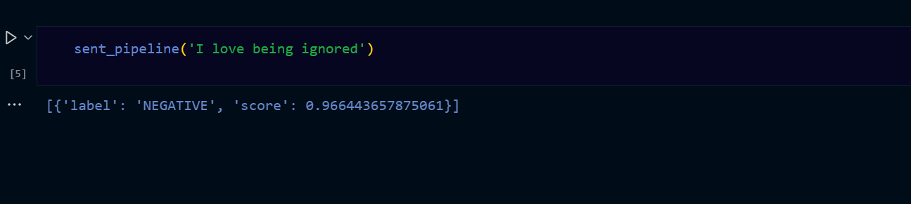

# TWITTER SENTIMENTAL ANALYSIS

## Goal

> The goal of this project is to predict whether a tweet on twitter is positive ,negative or neutral .

## Dataset

I have Downloaded this dataset from kaggle website. Here is the link:
:
[Dataset Link](https://www.kaggle.com/datasets/kazanova/sentiment140)

## Description

Project aims to improve sentiment analysis for Twitter data by integrating two powerful models: VADER and RoBERTa, within a transformer pipeline. Twitter data presents unique challenges due to its informal language, slang, and context-dependent sentiments. To address these challenges, we first employ VADER, a rule-based sentiment analysis tool specifically designed for social media text, to capture surface-level sentiment. Next, we leverage RoBERTa, a transformer-based language model known for its contextual understanding, to delve deeper into the nuanced emotions expressed in tweets as language context is important part of human speech. By combining the strengths of both models, our approach enhances sentiment analysis accuracy, providing a more comprehensive understanding of the human context within Twitter conversations. This project offers valuable insights for various applications, including market research, public opinion analysis, and social media monitoring.

## What i had done

> - Performing EDA ,Preprocessing:
>   > - Tokenize the text to break down tweets into individual words or subwords.
>   > - Remove noise such as URLs, special characters, and emojis.
>   > - Normalize text by converting to lowercase and handling contractions, abbreviations, and slang.
> - Feature engineering:
>   > - Converting the textual data into normal data .
>   >   \*By applying Vectorizer .
> - VADER Sentiment Analysis:
>   > - Apply the VADER assign sentiment scores to each token in the preprocessed tweets.
>   > - Calculate aggregate sentiment scores for each tweet based on the individual token scores.
>   > - Classify tweets into positive, negative, or neutral categories based on the aggregate sentiment scores.
> - RoBERTa Sentiment Analysis:
>   > - Encode the preprocessed tweets into numerical representations using the RoBERTa tokenizer.
>   > - Feed the encoded tweet sequences into the RoBERTa model for sentiment analysis.
>   > - Obtain sentiment predictions for each tweet, capturing nuanced sentiment nuances.
> - Integration of VADER and RoBERTa:
>   > - Combine the sentiment scores obtained from VADER and RoBERTa for each tweet.
> - Evaluation and Validation:
>   > - Assess the performance of the integrated sentiment analysis model using evaluation metrics such as accuracy

> - Applying tranformer pipeline as Roberta model's fine tuning process can be complex and time consuming so in order to fasten the process and making it less complex at last i have applied transformer pipeline also ..

## Models Used

-VADER
-RoBERTa(from hugging face)
-Transformer Pipeline

## Library Needed:

1. numpy.
2. pandas.
3. matplotlib.
4. seaborn.
   5.nltk
   6.Transformers library
   7.scikit-learn

## Visualization:

> The positive and negative tweets in the datset which was equal
> 

> Compund score of VADER MODEL of tweets that provides a single metric that represents the overall sentiment polarity of a piece of text
> 

> Comaprison between the positive negative and neutral tweets of the vader and RoBerta model ...
> Example Tweet: "Wow, just spent a fortune on the new 'amazing' product... it's definitely not overhyped at all! #sarcasm"
> VADER
> While words like "fortune" and "amazing" might have strong sentiment scores individually, VADER may not recognize the sarcasm conveyed by the surrounding context and emoticon.
> It might mistakenly interpret the tweet as positive due to the presence of the word "amazing" and assign a high compound score, failing to capture the sarcastic tone.
> ROBERTA
> It recognizes the contradiction between the positive language ("amazing" product) and the sarcastic tone conveyed by phrases like "just spent a fortune" and the eye-roll emoticon.
> RoBERTa can infer the true sentiment of the tweet as negative, despite the presence of positive words, by considering the overall context and linguistic cues.  
> The tranformer Pipeline
> The transformer pipeline is used to speed up the process as in applying roberta the complexity and the time of the model is increased .
> Hence transformer pipeline helps in dealing with the time ad complexity level..

##Accuracy
-VADER:The score of negative,neutral ,positive and compound of vader model is stored in vader_result
-ROBERTA:The score roberta_neg,roberta_neu,roberta_pos is stored in roberta_result ..

--The accuracy of the roberta model is higher to predict the sentiment of tweets as compared to the vader model

## Conclusion:

> Understanding the context of language is crucial in interpreting human speech. Some tweets or comments may contain sarcasm, which could be misinterpreted as negative sentiment or positive sentiment. RoBERTa excels in considering such contextual nuances, leading to higher accuracy in predicting sentiment for tweets. This is particularly valuable in ensuring that tweets are correctly classified, even when they contain sarcasm or subtle nuances.

> Created by [JagritiGautam793](https://github.com/JagritiGautam793) JWOC2024
