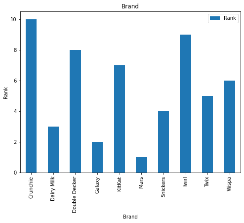
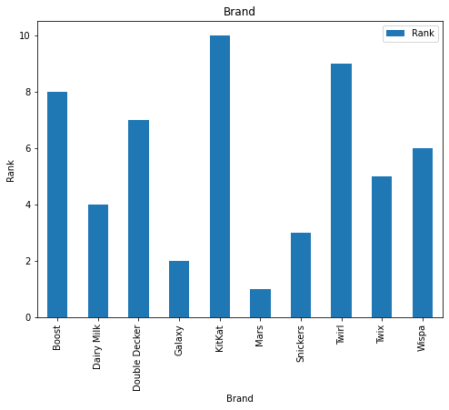

# *UK Favourite Chocolate Analysis*
_________________________________________
## **GOAL**

>To analyze the chocolate used by different age groups of people in UK based on the.
_________________________________________
## **DATASET**

>The dataset can be downloaded from [here](https://www.kaggle.com/yamqwe/2018-w13-what-is-the-uk-s-favorite-chocolate-bare)

________________________________________
## **DESCRIPTION**

>In this project, we have analysed the dataset by dividing in to different age buckets and the rankings of chocoalte for each age groups
_________________________________________
## **WHAT I HAD DONE**
_________________________________________
## Steps followed:
 > * Collected the dataset,checked for unique age buckets in the dataset which turns out to be 3[18-24, 35-44, 65+]
 > * Checked for unique brand name of chocolates and in turns out to be 13
 > * Filtered out each age bucket from the dataset 
 > * Performed visualization on the rankings of brand on each age bucket. 

## **VISUALIZATION.**
_________________________________________
## **Age group 18-24**

## **Age group 35-44**

## **Age group above 65**

_________________________________________
## **LIBRARIES NEEDED**

>* Pandas
>* Matplotlib

_________________________________________
## **CONCLUSION**

>From this project we can draw out many insights regarding the usage of chocolate by different age gropus of population in UK, it can help organisation to understand their target clients in a better way and can help in improving their business

_________________________________________
## **Contribution by**
[Vishnu Bhaarath K.N](https://github.com/VishnuBhaarath)
