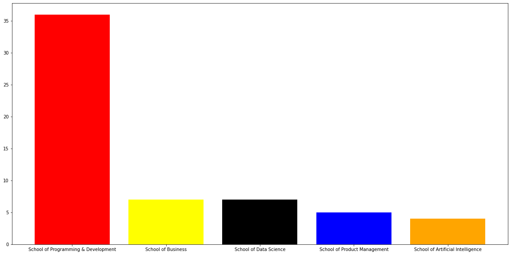
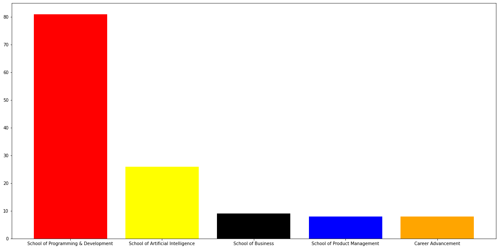
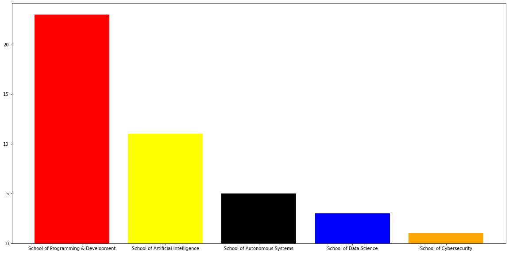

**Udacity Courses Analysis**

  

**GOAL**

  
 Analysing Udacity Courses Analysis with the help of python.

  

**DATASET**

 https://www.kaggle.com/khusheekapoor/udacity-courses-dataset-2021

  

**DESCRIPTION**

  
The main aim of the project is to analysis the dataset by taking different criterias in to account.

  

**WORK DONE**

* Analyzed the dataset, analysis are as follows
* Analyzed the beginner courses and plotted the top 5 ones with the highesh number of beginner courses
* Analyzed the intermediate courses and plotted the top 5 ones with the highest number
* Analyzed the advanced courses and plotted the top 5 ones.

  

**LIBRARIES NEEDED**

* pandas
* matplotlib

  
  

## **VISUALIZATION.**
_________________________________________
## **Maximum beginner courses top 5 **

## **Most intermediate courses top 5**

## **Most advanced courses top 5**

**CONCLUSION**

  

The dataset was analysed and the above analysis were made.
  

**CONTRIBUTION BY**

*Vishnu Bhaarath*

  
  
