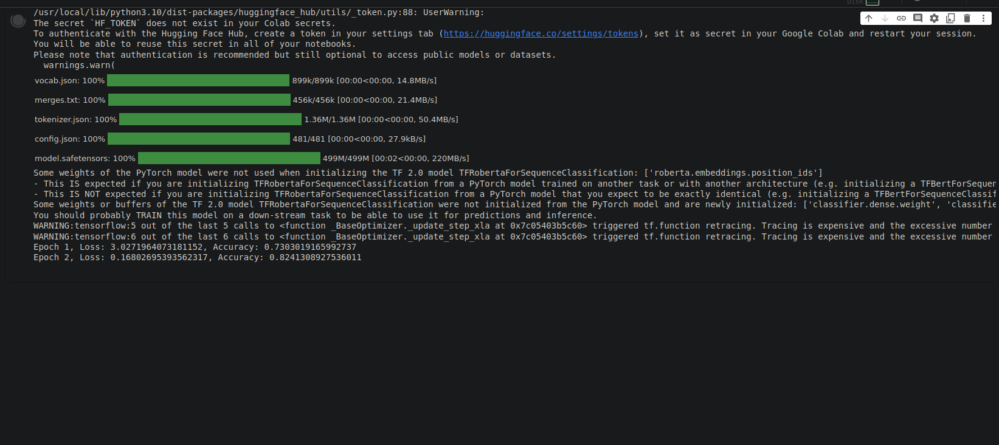

# VULNERABLE CANCER PREDICTION

## GOAL
Develop a deep learning model using sentiment analysis on a text database.

## DATASET
Explore [Mental Health Insights for Vulnerable Cancer Patients](https://www.kaggle.com/datasets/irinhoque/mental-health-insights-vulnerable-cancer-patients).

## MODELS USED
- Neural Networks
- LSTM
- GRU
- Roberta 

## LIBRARIES
- Pandas
- Numpy
- TensorFlow
- PyTorch
- Transformers
- Scikit-Learn

## IMPLEMENTATION
1. Load dataset (10,000 entries, 3 columns).
2. Clean text data (handle null values, spaces, capitalization).
3. Use 4 sentiment classes: Positive, Neutral, Negative, Very Negative.
4. Implement tokenization for sequence conversion.
5. Train models with various algorithms.

## Models and Accuracies

| Model             | Accuracy   | 
| ----------------- |:----------:| 
| Roberta           | 0.87 (expected)|                    
| LSTM              | 0.72       |                    
| Neural Network    | 0.67       |                    
| Logistic Regression| 0.71      |                    

**NOTE: No graphs were plotted**

**ROBERTA MODEL IN TENSORFLOW AND PYTORCH WERE PARTIALLY TRAINED DUE TO RESOURCE LIMITATIONS; RESULTS FROM 2 EPOCHS WILL BE PROVIDED**

**IMAGE**

## NAME
Keshav Arora
