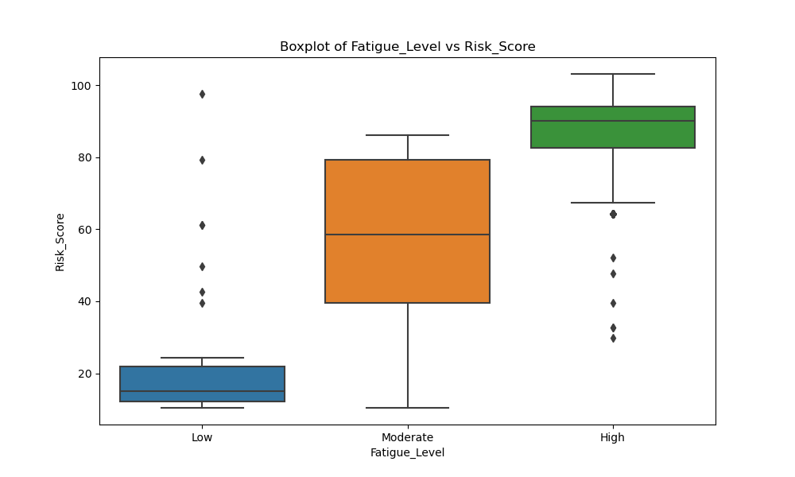
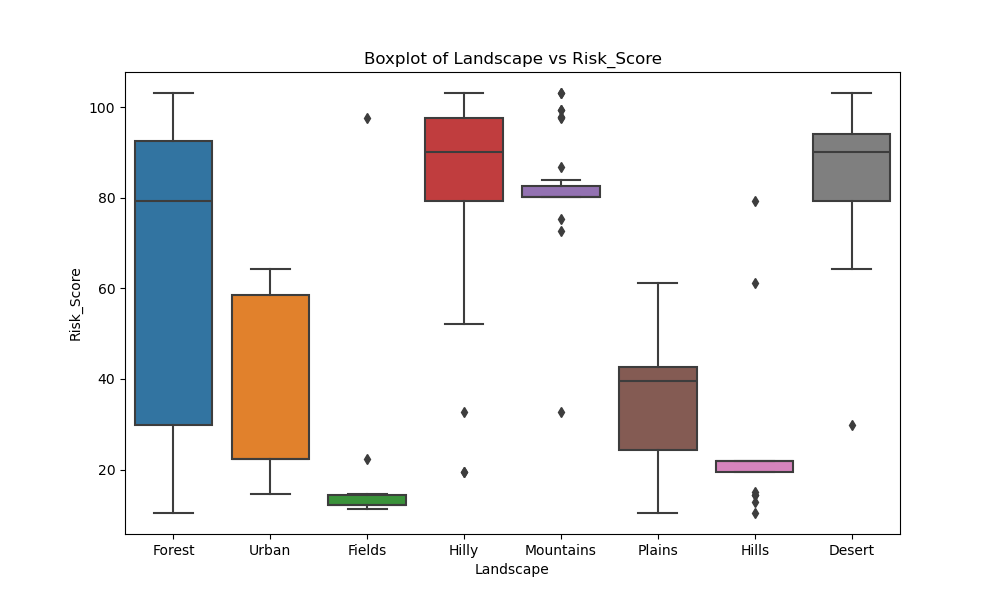
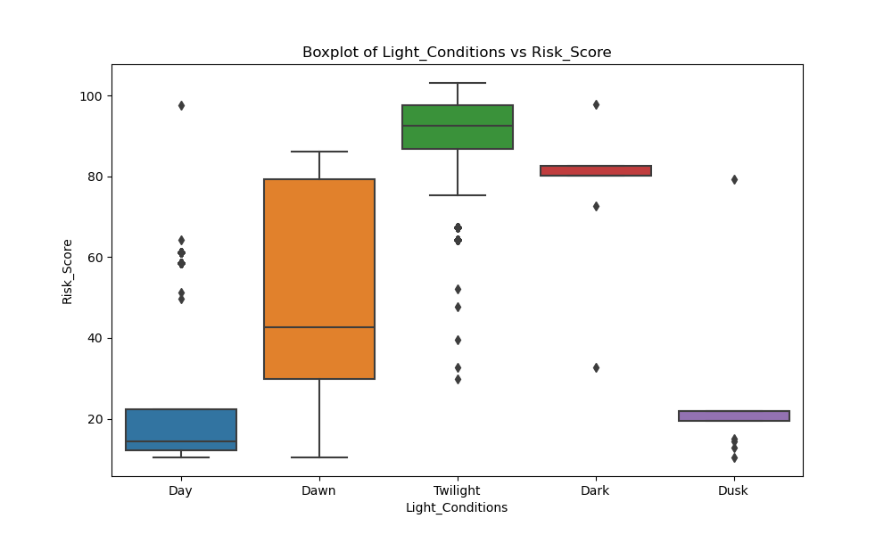
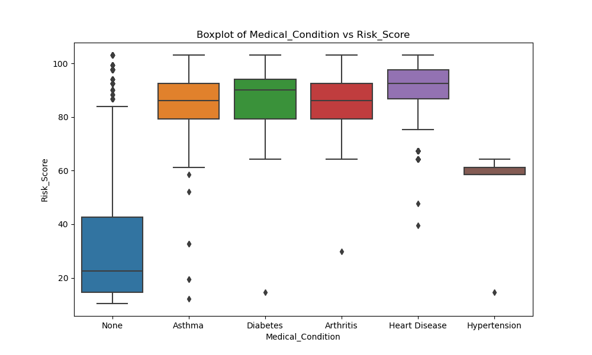
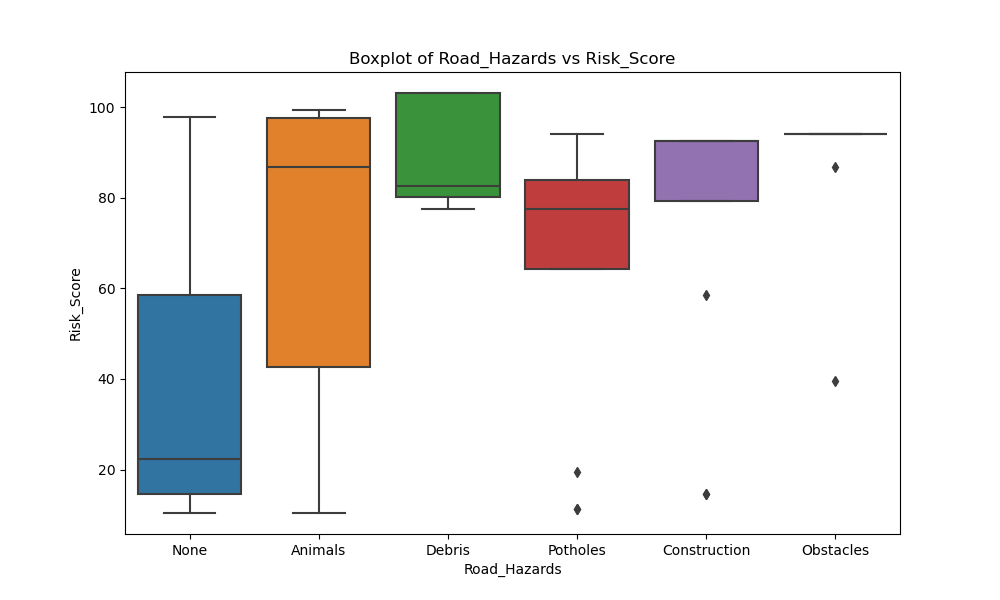
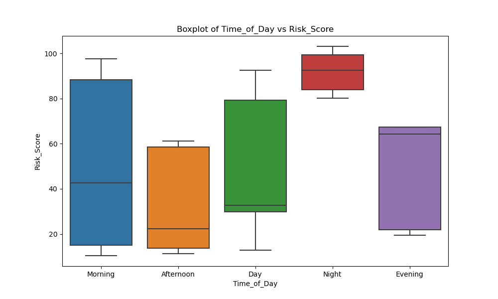
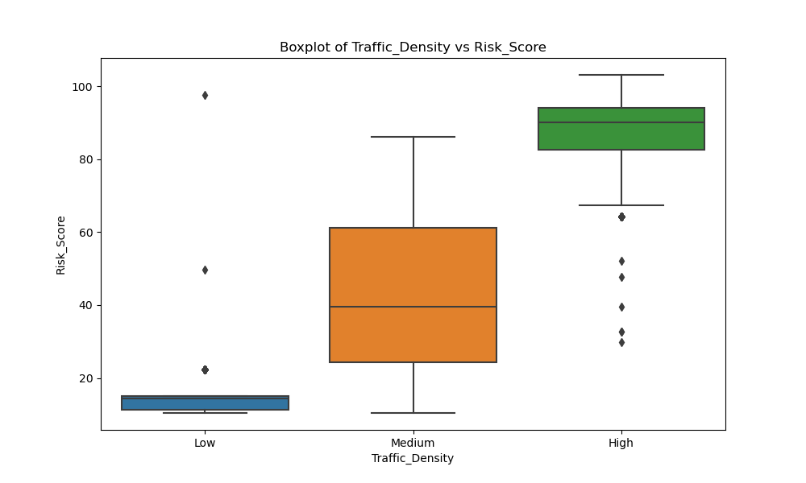
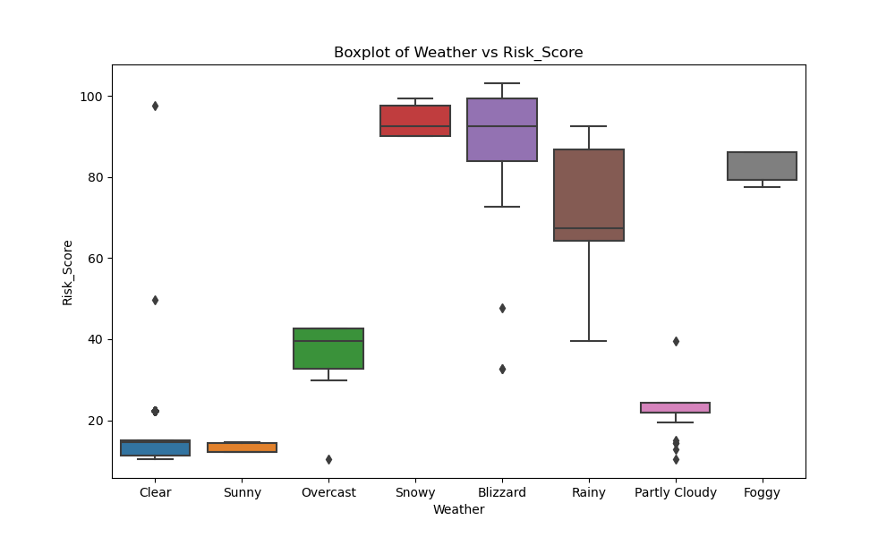

**VEHICLE LIVE RISK PREDICTION MODEL**


### Overview
The Vehicle Risk Prediction application is designed to predict the risk associated with driving a vehicle based on various factors such as weather conditions, road hazards, visibility, traffic density, and driver-related factors like fatigue level, speeding, and medical conditions. The application utilizes a machine learning model trained on historical data to provide risk predictions.


**GOAL**

To build a machine learning model for predicting the risk of accident or not.
'The aim is to create a web app for the Vehicle Live Risk Prediction project. Use the best existing model in the project folder. Follow the Web App README template for the same.'


**DATASET**

https://www.kaggle.com/datasets/punyamodi/vehicle-live-risk-prediction

**DESCRIPTION**

To analyze various factors that could possibly lead to an accident and then training all those factors via machine learning.

**Visualization and EDA of different attributes:**






















These sample images show relationship of columns with each other(more detail in notebook 1 with EDA)

**MODELS USED**
1) Decision Tree 
2) Random Forest
3) ANN 
4) Multivariate Logisitic Regression
5) Lasso
6) Gradient Boost
7) Ridge
8) MLP
9) XGBoost

**LIBRARIES**
1) PANDAS
2) NUMPY
3) TENSORFLOW
4) MATPLOTLIB
5) SEABORN
6) SCIKIT-LEARN
7) XGBOOST
8) streamlit

**IMPLEMENTATION**
1) Loaded the dataset with 20 columns having 15000 entries.
2) Implementated EDA with visualisation to check for relationships between data.
3) Model was trained efficiently with different algorithms
4) 50+ risk_score was considered as parameter for accident risk,whereas less than value signified no risk of accident.
4) Different notebooks with different models were used for clear and concise display of information for mentor.

**RESULT**
1) Decision Tree calculated exceptional accuracy of 0.9996.
2) Whereas rest of the models had perfection of 1.0
3) Reason was found to be all columns are organised so perfectly that each column has power to change result based on its patterns 
   for example:almost all speeding column entries having YES result provide >50 risk score.
4) Similar patterns can be observed with respect to other columns.
5) Various HyperParameters and column dropping was implemented to signify no overfitting for such a perfect database.


...

### Models and Accuracies

| Model                         | Accuracy   | MSE SCORE          |
| ----------------------------- |:----------:| ------------------:|
| Decision Tree                 | 0.9996     |                    |
| Random Forest                 | 1.0        |                    |
| ANN                           | 1.0        |                    |
| Logistic Regression           | 1.0        |                    |
| Lasso                         | N.A        | 0.03247239784420999|
| Gradient Boost                | 1.0        |                    |
| Ridge                         | N.A        | 0.007214250517408194|
| MLP                           | 0.9997     |                    |
| XGBoost                       | 1.0        |                    |


...
### Model(s) used for the Web App 
XGBoost (Extreme Gradient Boosting) is a powerful and widely-used machine learning algorithm known for its efficiency and effectiveness in predictive modeling tasks. It belongs to the ensemble learning methods, specifically boosting algorithms, and has gained popularity for its exceptional performance in various machine learning competitions and real-world applications.

#### Install Requirements
 While the virtual environment is activated, install the required packages using pip:
  ```
  pip install -r requirements.txt
  ```
#### Run the Application
 After installing the requirements, run the Streamlit application using the following command:
 ```
  streamlit run app.py
  ```


### Functionality
#### Main Model Page:
- **Input Fields:** Users can enter details such as Visibility, Road Surface Conditions, Weather, Traffic Density, Road Hazards, Fatigue Level, Medical Condition, Speeding, and Light Condition.
- **Prediction:** After entering the required information and clicking on the "Predict Risk" button, the application calculates the risk level (High Risk or Low Risk) based on the user's input.


#### Visualization Page:
- **Data Overview:** Displays the first few rows of the dataset and provides an overview of the data.
- **Data Statistics:** Shows summary statistics of numerical columns in the dataset.
- **Correlation Heatmap:** Visualizes the correlation between numerical features using a heatmap.
- **Countplots of Categorical Features:** Displays count plots for each categorical feature in the dataset.


#### About Page:
- **Model Explanation (XGBoost):** Provides an explanation of the machine learning model used in the application, focusing on the XGBoost (Extreme Gradient Boosting) algorithm.
- **Purpose:** Explains the purpose and goal of the Vehicle Risk Prediction application.


### How to Use
1. **Navigation:** Use the sidebar to navigate between the Main Model Page, Visualization Page, and About Page.
2. **Main Model Page:**
   - Fill in all required fields with relevant information.
   - Click on the "Predict Risk" button to see the risk prediction.
3. **Visualization Page:**
   - Explore data overview, statistics, correlations, countplots, and pairplots to gain insights into the dataset.
4. **About Page:**
   - Provides information about the model explanation and purpose of the application.


### Signature ✒️

Name:-Shivansh Mahajan

Github:-https://github.com/shivansh-2003

Linkedin:-https://www.linkedin.com/in/shivansh-mahajan-13227824a/
