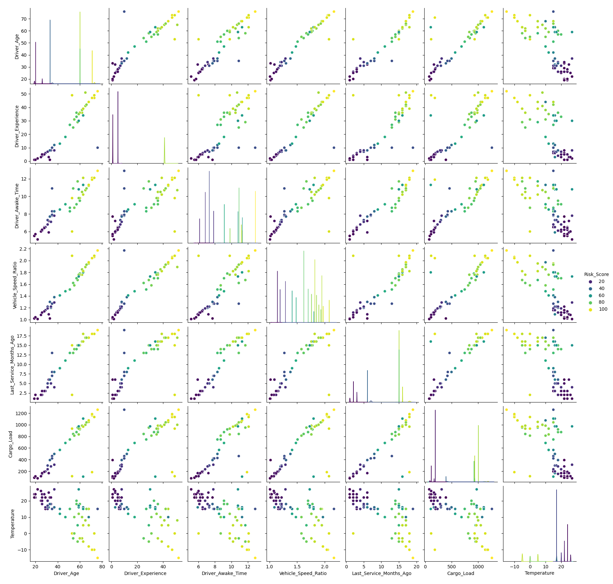

**VEHICLE LIVE RISK PREDICTION MODEL**

**GOAL**

To build a machine learning model for predicting the risk of accident or not.

**DATASET**

https://www.kaggle.com/datasets/punyamodi/vehicle-live-risk-prediction

**DESCRIPTION**

To analyze various factors that could possibly lead to an accident and then training all those factors via machine learning.

**Visualization and EDA of different attributes:**

These sample images show relationship of columns with each other(more detail in notebook 1 with EDA)

**MODELS USED**
1) Decision Tree 
2) Random Forest
3) ANN 
4) Multivariate Logisitic Regression

**LIBRARIES**
1) PANDAS
2) NUMPY
3) TENSORFLOW
4) MATPLOTLIB
5) SEABORN

**IMPLEMENTATION**
1) Loaded the dataset with 20 columns having 15000 entries.
2) Implementated EDA with visualisation to check for relationships between data.
3) Model was trained efficiently with different algorithms
4) 50+ risk_score was considered as parameter for accident risk,whereas less than value signified no risk of accident.
4) Different notebooks with different models were used for clear and concise display of information for mentor.

**RESULT**
1) Decision Tree calculated exceptional accuracy of 0.9996.
2) Whereas rest of the models had perfection of 1.0
3) Reason was found to be all columns are organised so perfectly that each column has power to change result based on its patterns 
   for example:almost all speeding column entries having YES result provide >50 risk score.
4) Similar patterns can be observed with respect to other columns.
5) Various HyperParameters and column dropping was implemented to signify no overfitting for such a perfect database.

**NAME**
Keshav Arora
