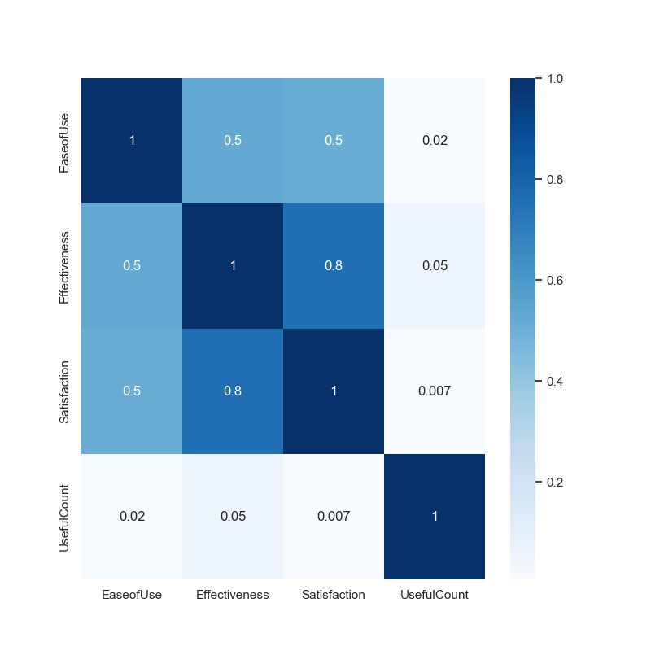
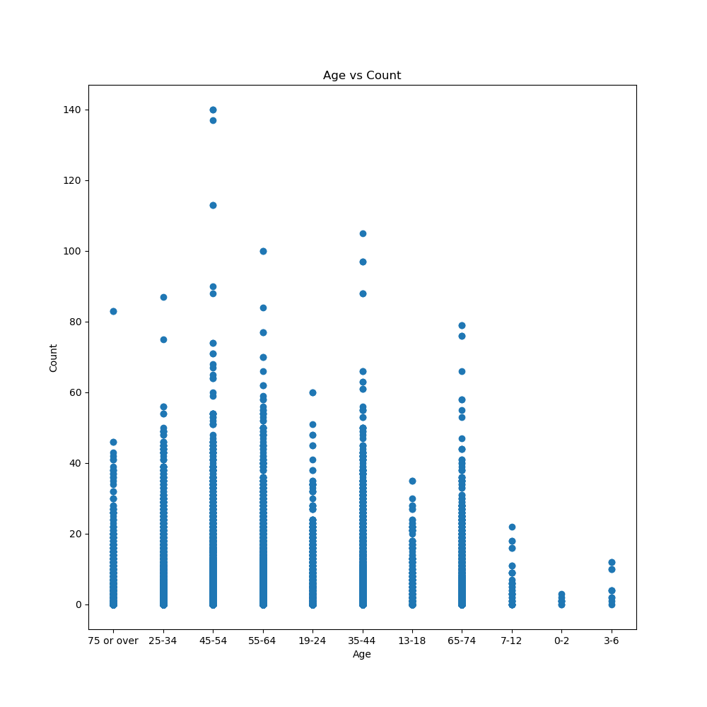
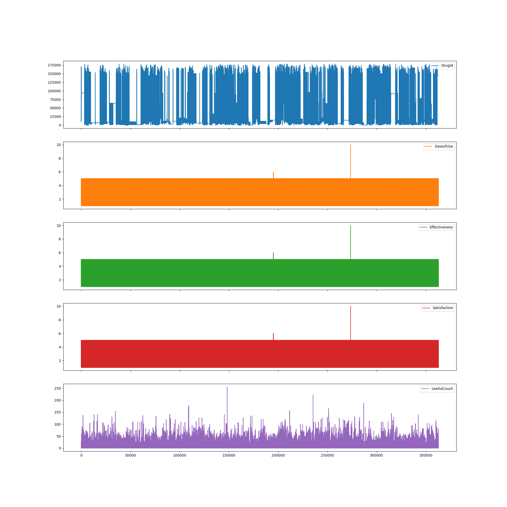
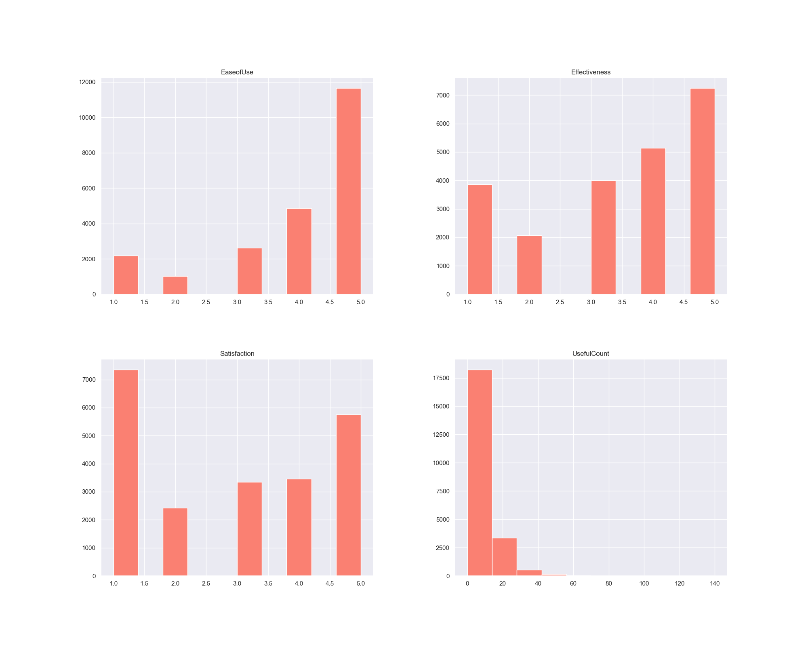
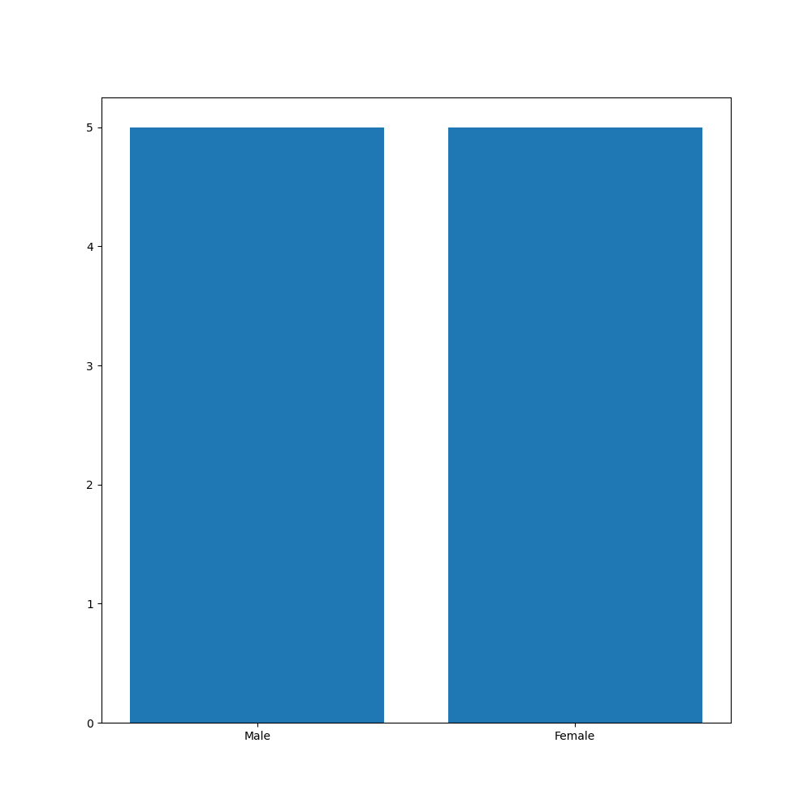
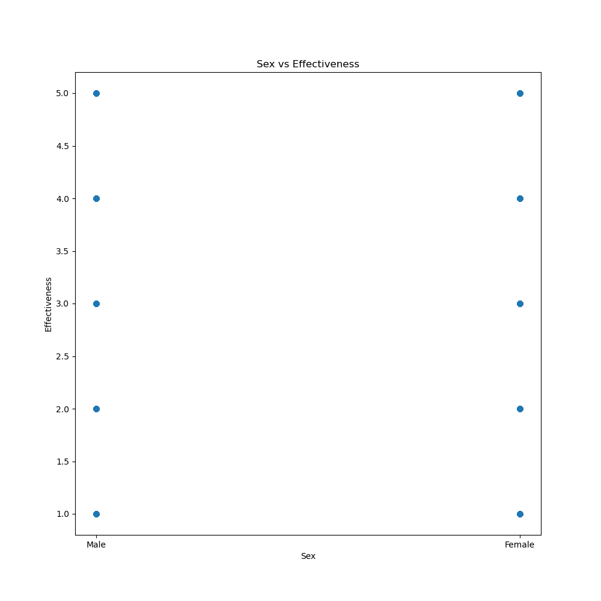
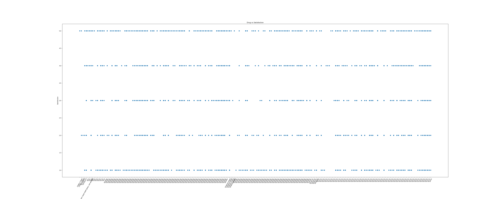

<h1>WebMD Drug Review</h1>

**GOAL**

To build a machine learning model for predicting the drug analysis.

**DATASET**

https://www.kaggle.com/rohanharode07/webmd-drug-reviews-dataset

**DESCRIPTION**

To analyze the dataset of drugs and build and train the model on the basis of different features and variables.

There are 2 types of datasets:

- `columns_descriptions`: This dataset contains the description of all the features.
- `support2`: This dataset contains 362000 entries with 13 different features.

## About the WebMD Drug Dataset

* Drug (categorical): name of drug.
* DrugId (numerical): drug id.
* Condition (categorical): name of condition.
* Review (text): patient review.
* Side (text): side effects associated with drug (if any).
* EaseOfUse (numerical): 5 star rating.
* Effectiveness (numerical): 5 star rating.
* Satisfaction (numerical): 5 star rating.
* Date (date): date of review entry.
* UsefulCount (numerical): number of users who found review useful.
* Age (numerical): age group range of user.
* Sex (categorical): gender of user.

This dataset intended to answer following questions:

1. Identifying the condition of the patient based on drug reviews?
2. How to predict drug rating based on patient’s reviews?
3. How to visualize drug rating, kind of drugs, types of conditions a patient can have, sentiments based on reviews?

### Visualization and EDA of different attributes:

**MODELS USED**

| Model                     | MSE       | R2       | RMSE      | MAE       |
|---------------------------|-----------|----------|-----------|-----------|
| Random Forest Regression  | 0.73      | 0.65     | 0.85      | 0.57      |
| Gradient Boost Regressor  | 0.76      | 0.64     | 0.87      | 0.64      |
| SVR                       | 0.82      | 0.61     | 0.90      | 0.59      |
| Decision Tree Regression  | 1.06      | 0.50     | 1.03      | 0.56      |
| XG Boost Regression       | 0.71      | 0.60     | 0.84      | 0.60      |
| LightGBM Regressor        | 0.73      | 0.66     | 0.85      | 0.61      |
| Cat Boost Regressor       | 0.71      | 0.66     | 0.84      | 0.61      |

**WHAT I HAD DONE**

* Load the dataset which contains 362000 entries in it and having 13 columns in it.
* Checked for missing values and cleaned the data accordingly.
* Analyzed the data, found insights and visualized them accordingly.
* Plotting heatmap using correlation and checking the relation between different features.
* Found detailed insights of different columns with target variable using plotting libraries.
* Train the datasets by different models and saves their accuracies into a dataframe.

**LIBRARIES NEEDED**

1. Pandas
2. Matplotlib
3. Sklearn
4. NumPy
5. XGBoost
6. Tensorflow
7. Keras
8. Sci-py
9. Seaborn
10. CatBoost
11. LightGBM

**CONCLUSION**

- Random Forest and Cat Boost Regressor and Light GBM Regressor models show promising performance with lower MSE and higher R2 values.
- Decision Tree Regressor achieved very high MSE and very low R2 on the training set. This shows the model can't be used for the drug analysis.
- Other models such as SVR, XGBoost, Gradient too performed good on the training and testing data which shows these model can be used.

**YOUR NAME**

*Pawas Pandey*
